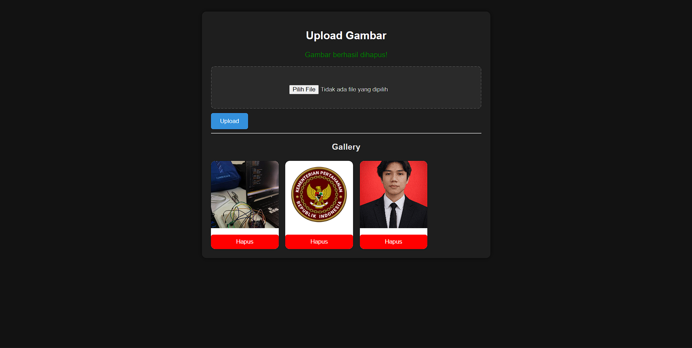

# 📸 Laravel Image Upload & Storage

A web-based application built with Laravel that allows users to upload, view, and delete images. This project also provides RESTful APIs for image management, making it suitable for integration with frontend frameworks like React or mobile applications.

---

## 🚀 Features

### 🖥️ Web Features

- Upload image
- Display image gallery
- Delete image
- Clean UI using Blade & custom CSS

### 🌐 API Features

- Get all images (JSON)
- Upload image via API
- Delete image via API

---

## 🛠️ Tech Stack

- **Backend**: Laravel
- **Frontend**: Blade Template Engine
- **Database**: MySQL
- **Storage**: Laravel Storage (public disk)
- **API**: RESTful API

---

## ⚙️ Installation & Setup

1. Clone repository

```bash
git clone https://github.com/username/upload-image-app.git
cd upload-image-app
```

2. Install dependencies

```bash
composer install
```

3. Setup environment

```bash
cp .env.example .env
php artisan key:generate
```

4. Configure database in `.env`

5. Run migration

```bash
php artisan migrate
```

6. Link storage

```bash
php artisan storage:link
```

7. Run server

```bash
php artisan serve
```

---

## 🌐 API Endpoints

| Method | Endpoint         | Description    |
| ------ | ---------------- | -------------- |
| GET    | /api/images      | Get all images |
| POST   | /api/upload      | Upload image   |
| DELETE | /api/images/{id} | Delete image   |

---

## 📸 Screenshots

### Dashboard



---

## 📌 Notes

- Uploaded images are stored in:

```
storage/app/public/images
```

- Public access:

```
public/storage/images
```

---

## 👨‍💻 Author

**Zaki Juniansyah**
Junior Fullstack Web Developer
test git pull

---

## ⭐️ Support

If you like this project, give it a ⭐️ on GitHub!
